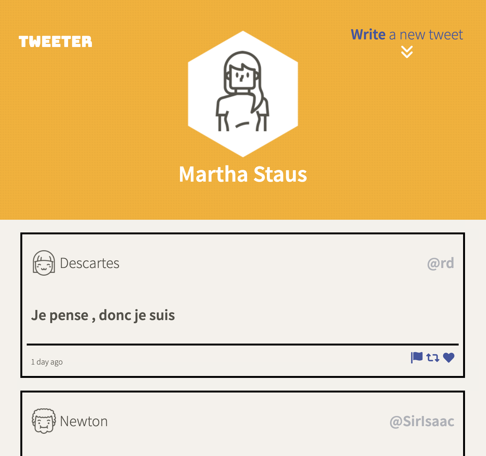
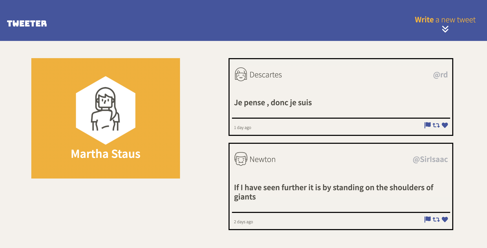

# Tweeter Project

Tweeter is a simple, single-page Twitter clone.

This app was built to practice HTML, CSS, JS, jQuery and AJAX front-end skills, as well as Node, Express back-end skills.

## Final Product
https://user-images.githubusercontent.com/84533333/148558760-f3125e86-bddf-4b3b-8fc8-6f4e75c87e77.mov

### Mobile

### Desktop

## Getting Started

1. [Create](https://docs.github.com/en/repositories/creating-and-managing-repositories/creating-a-repository-from-a-template) a new repository using this repository as a template.
2. Clone your repository onto your local device.
3. Install dependencies using the `npm install` command.
3. Start the web server using the `npm run local` command. The app will be served at <http://localhost:8080/>.
4. Go to <http://localhost:8080/> in your browser.

## Dependencies

- Express
- Node 5.10.x or above
- Body-parser
- Chance
- md5
- timeago.js

